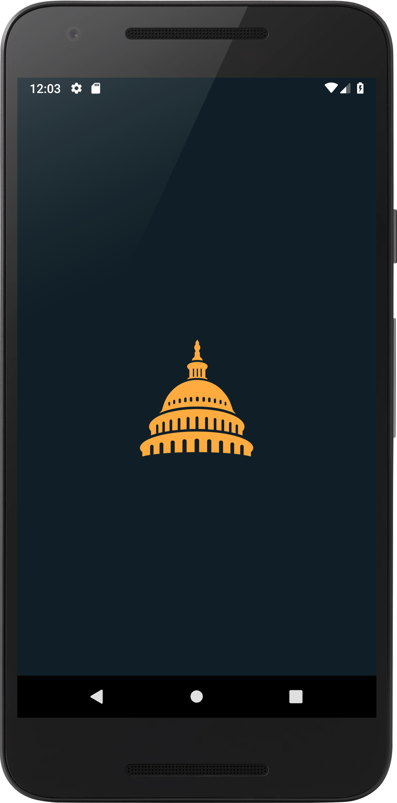

# Represent!
##### by Alexander Chen
Represent is an app that allows you to lookup congress members, based on either your last known location, your zip code input or just random location for you to explore.

 

## Search Options
* __Zip Code Input__
  * Display the result based on the zip code input. If the zip code spans across multiple congressional districts, all the congress members will be displayed.
* __Current Location__
  * Display the result based on the last known location on the device. This will provide exactly one congressional district.
* __Random Location__
  * Display the result based on a randomized zip code. Results might span across multiple congressional district.

## Library Used
* [Volley by Google](https://github.com/google/volley) for HTTP Requests
* [Floating Search View by arimorty](https://github.com/arimorty/floatingsearchview) for persistent search bar
* [CircleImageView by hdodenhof](https://github.com/hdodenhof/CircleImageView) for circular images
* [Glide by bumptech](https://github.com/bumptech/glide) for loading images from the web

## Images Used
* [Congress Dome Image](http://ir-webdesign.cz/images/dome-capital.png)
* [Profile Image PlaceHolder](https://static1.squarespace.com/static/5abff4fe5417fcb7d8236be7/t/5b4681af2b6a286a632e38cb/1531347393460/placeholder.png)
